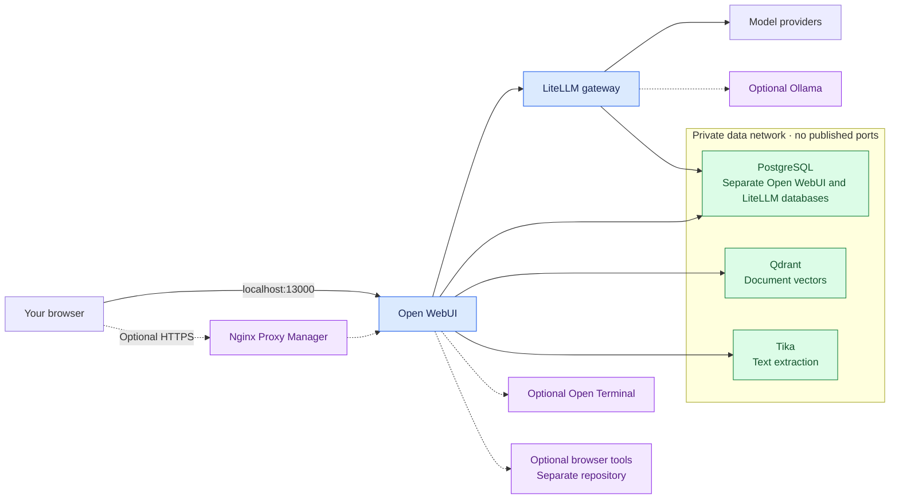
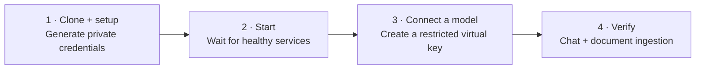
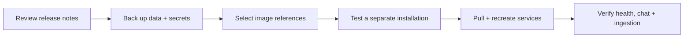

# Open WebUI Stack Starter

**Chat · Model gateway · Document search · Optional local inference**

A fresh-install Docker Compose starter for Open WebUI, PostgreSQL, LiteLLM,
Qdrant and Apache Tika. Optional profiles add Nginx Proxy Manager, Ollama and
Open Terminal. Browser automation is available as a separate optional add-on.

This is a new installation, not a migration or copy of any existing application
data. It contains no provider credentials, user accounts, documents, internal
hostnames, custom branding, database dumps, or inherited Git history.

Start with [installation](#1-generate-private-configuration), then
[connect a model](#3-connect-a-model). See [optional features](#optional-features),
[versions](#versions-and-update-policy), [upgrades](#upgrading-deliberately),
[maintenance](#database-initialization-and-maintenance),
[troubleshooting](#troubleshooting), and the [validation record](VALIDATION.md).

## Architecture



Solid arrows show core connections; dashed arrows show optional connections.
Open WebUI sends model requests through LiteLLM, extracts documents with Tika,
and stores embeddings in Qdrant. The diagram shows service relationships, not
every network attachment; [compose.yaml](compose.yaml) defines the exact networks.

PostgreSQL uses separate non-superuser application roles. Data services have no
host ports. Volumes and networks belong to the selected Compose project; no
live deployment's explicit volume or container names are reused.

## Versions and update policy

> [!IMPORTANT]
> **This starter does not automatically install the newest releases.** Most images
> are pinned by immutable digest. `docker compose pull` fetches the configured
> image; it does not select a newer application version or restart containers.

Version inventory checked **2026-09-11**. These are the shipped defaults, not a
list of the latest upstream releases. Your `.env` image overrides take precedence.

| Component | Version in the default image | Pin | Validation |
| --- | --- | --- | --- |
| Open WebUI | **0.11.1** | SHA-256 digest | Core runtime tested |
| LiteLLM | **1.100.0** release reference | Release tag + SHA-256 digest | Core runtime tested |
| PostgreSQL | **16.15** | Major tag `16` + SHA-256 digest | Core runtime tested |
| Qdrant | **1.19.0** | SHA-256 digest | Core runtime tested |
| Apache Tika | **4.0.0** | SHA-256 digest | Core runtime tested |
| Nginx Proxy Manager | **2.15.1** release reference | Release tag only | Optional; configuration checked |
| Ollama | **0.30.10** client | SHA-256 digest | Optional; configuration and version checked |
| Open Terminal | **0.12.3** | SHA-256 digest | Optional; configuration and version checked |

The full image references are in [compose.yaml](compose.yaml). Versions were
identified from runtime output, image/package metadata, or the stated release
reference. Optional version checks do not mean those integrations were tested
end to end. See [VALIDATION.md](VALIDATION.md) for the exact scope.

A digest fixes image content, even if the reference also includes a tag such as
`16`. A tag alone can be reassigned upstream, so NPM's release-tag pin is less
strict than the other pins. None of these pins automatically receives security
updates. Review releases regularly and follow [the upgrade procedure](#upgrading-deliberately).
See [Docker's explanation of image digests](https://docs.docker.com/dhi/explore/security-concepts/digests/).

## Setup at a glance



The commands and configuration choices for each step are below. Containers can
be healthy before you have configured a usable model.

## Requirements

- Linux Docker host with Docker Engine and Compose v2, Bash, Python 3, and Git.
- Permission to use Docker. Check `docker info` and `docker compose version`.
- Internet access for images and providers; Open WebUI may download its default
  embedding model on first use. Local inference needs additional RAM and disk.
- An existing provider account or a local model configured in optional Ollama.
- SSH access if viewing the host's localhost-only services from another computer.

This does not install Docker, buy provider access, download an Ollama model, or
configure a domain automatically. See [SECURITY.md](SECURITY.md) before exposing
anything publicly and [THIRD-PARTY.md](THIRD-PARTY.md) for image/license details.

## 1. Generate private configuration

Run on your Docker host. Clone the repository, then generate your own credentials:

```bash
git clone https://github.com/AngelN-Halo/open-webui-stack-starter.git open-webui-stack
cd open-webui-stack
./setup.sh --admin-email admin@example.com
```

If you already have a checkout, enter its directory and run setup there. All
subsequent Compose commands run from this directory unless stated otherwise.

Replace the example email with your administrator email. Setup creates `.env`
with independent random passwords and keys (mode 0600), then validates Compose.
It never overwrites an existing `.env` and never starts services. Open `.env` in
your local editor to review ports and record the generated login credentials
privately. Do not paste `.env` or unredacted Compose output into bug reports.

The defaults use project `open-webui-stack`, Open WebUI port 13000, and LiteLLM
port 14000, all on host loopback. For another installation:

```bash
./setup.sh --project-name my-ai-stack --admin-email admin@example.com
```

Choose a unique project name before first startup and different host ports for
each installation. Changing the project name later selects different volumes;
your existing accounts/data do not move. Shell environment variables override
`.env`; avoid stale exported passwords, ports or project names.

Set `WEBUI_URL` to the browser URL you actually use, including any custom port.
It also sets the allowed browser origin; the starter does not default to wildcard
CORS access.

Keep generated database passwords as hexadecimal strings. Custom passwords used
in connection URLs need correct URL encoding; raw punctuation can break a URL.

### Configuration reference

Edit the local `.env` before first startup. Image overrides are optional; the
tested defaults are recorded in `compose.yaml`.

| Setting | Purpose |
| --- | --- |
| `COMPOSE_PROJECT_NAME` | Unique installation name and prefix for networks/volumes |
| `OPEN_WEBUI_PORT`, `LITELLM_PORT` | Host loopback ports; defaults 13000 and 14000 |
| `WEBUI_URL` | Full browser-facing URL, also used as the allowed browser origin |
| `WEBUI_ADMIN_EMAIL`, `WEBUI_ADMIN_PASSWORD` | First-install Open WebUI administrator login |
| `WEBUI_SECRET_KEY` | Persistent application secret; preserve with backups |
| `POSTGRES_PASSWORD` | Database administrator password; not used by applications |
| `WEBUI_DB_PASSWORD`, `LITELLM_DB_PASSWORD` | Independent application database passwords |
| `QDRANT_API_KEY` | Shared by Qdrant and its Open WebUI client |
| `LITELLM_UI_PASSWORD` | LiteLLM administrator UI password for username `admin` |
| `LITELLM_MASTER_KEY` | Privileged gateway API key; keep out of ordinary client applications |
| `LITELLM_SALT_KEY` | Encryption secret for stored provider credentials; preserve with backups |
| `LITELLM_WEBUI_KEY` | Optional first-boot virtual key; normally configured in Open WebUI's Admin UI |
| `COMPOSE_PROFILES` | Optional comma-separated `proxy,ollama,terminal` selection |
| `PROXY_BIND`, `PROXY_*_PORT` | Optional proxy host bindings; administration always uses loopback |
| `OPEN_TERMINAL_API_KEY` | Bearer key for the optional terminal integration |

The generated administrator password is for a fresh database only. If `.env`
already exists, rerunning setup with another email or project name leaves it
unchanged; edit it before the first launch or use the application's account
settings after initialization.

## 2. Start the core stack

```bash
docker compose pull
docker compose up -d --wait --wait-timeout 600
docker compose ps -a
docker compose logs --tail=100
```

First startup initializes two databases and applies application migrations.
The command waits for application health checks and can take several minutes.
Open WebUI waits for PostgreSQL and LiteLLM readiness. Tika and Qdrant may take
additional time to become ready; the check script below verifies them explicitly.

On the Docker host, open:

| Service | URL | Login |
| --- | --- | --- |
| Open WebUI | `http://localhost:13000` | `WEBUI_ADMIN_EMAIL` / `WEBUI_ADMIN_PASSWORD` |
| LiteLLM Admin UI | `http://localhost:14000/ui` | `admin` / `LITELLM_UI_PASSWORD` |

For a remote host, run this on your workstation and keep it running:

```bash
ssh -N -o ExitOnForwardFailure=yes -L 127.0.0.1:13000:127.0.0.1:13000 -L 127.0.0.1:14000:127.0.0.1:14000 USER@DOCKER_HOST
```

Then use the same localhost URLs on your workstation. Replace the SSH placeholders
and adjust tunnel ports if you changed `.env` or your local ports are occupied.

## 3. Connect a model

The initial model list is empty. A healthy stack does not imply that a model is
configured or that provider access is free.

1. Sign into LiteLLM, add a provider/model under Models + Endpoints, and test it.
   Provider credentials are stored in PostgreSQL encrypted using `LITELLM_SALT_KEY`.
2. Create a virtual key for Open WebUI. Restrict its model access, rate limits and
   budget. Copy it privately; do not give Open WebUI the LiteLLM master key.
3. In Open WebUI's administrator connection settings, edit the OpenAI-compatible
   connection. Use URL `http://litellm:4000/v1` and the virtual key.
4. Refresh models, select one in a new chat and send a short test message.

The connection URL is already seeded by Compose. `LITELLM_WEBUI_KEY` can seed a
key on first boot, but after setup use the Admin UI: Open WebUI persists many
settings in its database, so later `.env` changes may not override them.

See [LiteLLM's setup guide](https://docs.litellm.ai/docs/proxy/docker_quick_start)
and [Open WebUI's configuration reference](https://docs.openwebui.com/reference/env-configuration/).

## 4. Verify document processing

```bash
./scripts/check.sh
```

This checks service health, PostgreSQL role boundaries, authenticated Qdrant
access, Tika and LiteLLM connectivity. It does not call a paid model or inspect
your chats. Then upload a small public text/PDF document into Open WebUI Knowledge
and ask a question whose answer appears in it. Verify ingestion and citations.
The default embedding model may download on first use; a chat model alone does
not configure embeddings. Change embedding models deliberately and reindex
affected collections rather than mixing vector dimensions.

## Optional features

Profiles can be enabled permanently in `.env`, for example
`COMPOSE_PROFILES=proxy,ollama`. Run `docker compose up -d` afterward. Removing a
profile from `.env` alone does not stop containers previously started with it.

To stop an optional service explicitly, use its matching command:

```bash
docker compose --profile proxy stop npm
docker compose --profile ollama stop ollama
docker compose --profile terminal stop open-terminal
```

Stopping retains the service's data. To resume, use its `up -d` command below.

### Nginx Proxy Manager

```bash
docker compose --profile proxy up -d npm
```

Open `http://localhost:18081` on the host or forward that port through SSH.
Complete the initial account setup for the selected NPM release. Add a Proxy Host
pointing to `http://open-webui:8080`, enable WebSocket support, and configure HTTPS.
NPM keeps its own SQLite database and certificate volume; it cannot directly
reach PostgreSQL, Qdrant or Tika through the data network.

For public HTTPS, set `PROXY_BIND=0.0.0.0`, `PROXY_HTTP_PORT=80` and
`PROXY_HTTPS_PORT=443`, check that those ports are free, configure DNS/firewall
rules and set `WEBUI_URL` to your HTTPS URL (also update it in the Admin UI if
already initialized). Port 81 administration remains on localhost. Default
18080/18443 bindings are for local testing, not HTTP-based certificate validation.
An existing reverse proxy can be used instead of starting another NPM instance.
See [NPM setup](https://nginxproxymanager.com/setup/).

### Ollama

```bash
docker compose --profile ollama up -d ollama
docker compose exec ollama ollama pull YOUR_MODEL
```

Choose a model that fits your hardware and license requirements. In LiteLLM,
configure the Ollama provider with API base `http://ollama:11434`, the model you
pulled, and a friendly model alias. Permit that alias on the Open WebUI virtual
key. This default is CPU-only; GPU passthrough requires host-specific setup.
No Ollama host port is published. Open WebUI connects through LiteLLM.

### Open Terminal

```bash
docker compose --profile terminal up -d open-terminal
```

In Open WebUI's administrator Open Terminal integration settings, add
`http://open-terminal:8000`, schema `/openapi.json`, Bearer authentication and
the generated `OPEN_TERMINAL_API_KEY`. Keep access administrator-only. Its home
directory persists in `terminal-data`; it is shared, not isolated per user.

### Browser tools

Use the separately published [Browser Workspace](https://github.com/AngelN-Halo/open-webui-browser-workspace)
for either headless or visible Chromium. This avoids maintaining two diverging
copies of the browser service definitions.

```bash
git clone https://github.com/AngelN-Halo/open-webui-browser-workspace.git ../open-webui-browser-workspace
cd ../open-webui-browser-workspace/addons/visible-browser
OPEN_WEBUI_NETWORK=open-webui-stack_webui ./setup.sh
```

Use `addons/headless-browser` instead for headless mode. If you changed the stack's
project name, replace `open-webui-stack` in the network name. If the add-on already
has `.env`, edit `OPEN_WEBUI_NETWORK` there: setup will not overwrite it. Continue
with that repository's build/start and Open WebUI registration instructions.
For multiple browser deployments, give each its own Compose project name and
visible profile volume; defaults in the separate repository are single-instance.

## Database initialization and maintenance

`db/init/01-create-databases.sh` creates `openwebui` and `litellm`, each owned by
its corresponding restricted login. Passwords come from `.env`; no SQL contains
literal credentials. PostgreSQL runs this only on an empty data volume. Each
application then creates/migrates its own tables.

Editing `.env` does not alter existing PostgreSQL passwords, application admin
passwords, or already-encrypted provider credentials. For password rotation,
update the database role and its client configuration together. Preserve
`WEBUI_SECRET_KEY` and `LITELLM_SALT_KEY` with backups. Never delete the database
volume just to apply new credentials. See [PostgreSQL initialization](https://hub.docker.com/_/postgres).

Stop and resume without removing data:

```bash
docker compose stop
docker compose start
```

`docker compose down` removes containers/networks but retains named volumes.
Adding `--volumes` deletes data: do not use it on an installation you intend to
keep. Optional services may require their profiles enabled for Compose operations.

Before updates, back up both PostgreSQL databases, Open WebUI files, Qdrant
collections and `.env` as one recoverable set. Include optional terminal data,
proxy database/certificates and browser profile volumes when used. Use PostgreSQL
logical dumps and Qdrant snapshots or a consistent stopped-stack backup; copying
live database files is not a reliable backup. Encrypt archives and test restoring
into a separate project. No destructive demo-reset scripts are included.

## Upgrading deliberately



1. Read upstream release notes and migration instructions. Record the current
   image references and preserve the recoverable backup set described above.
2. Choose a release and preferably its digest for each changed service. Set its
   override in your private `.env`. For example, `OPEN_WEBUI_IMAGE` replaces the
   complete Open WebUI image reference; use an actual verified release/digest,
   not the instructional placeholders in `.env.example`.
3. Test a separate project with different ports and isolated volumes. Restore a
   backup into that separate project when you need to test data migration.
4. During your maintenance window, run from the installation directory:

   ```bash
   docker compose config --quiet
   docker compose pull
   docker compose up -d --wait --wait-timeout 600
   ./scripts/check.sh
   ```

5. Confirm administrator login, a real model request, document ingestion and
   restart persistence. Check enabled optional integrations too. Keep the previous
   backup until the new release has been accepted.

| Service | Override in `.env` |
| --- | --- |
| Open WebUI | `OPEN_WEBUI_IMAGE` |
| LiteLLM | `LITELLM_IMAGE` |
| PostgreSQL | `POSTGRES_IMAGE` |
| Qdrant | `QDRANT_IMAGE` |
| Tika | `TIKA_IMAGE` |
| Nginx Proxy Manager | `NPM_IMAGE` |
| Ollama | `OLLAMA_IMAGE` |
| Open Terminal | `OPEN_TERMINAL_IMAGE` |

Enable your optional profiles for the pull/update commands, either through
`COMPOSE_PROFILES` or the matching `--profile` flags. `git pull --ff-only` updates
repository files; `docker compose pull` downloads images; `docker compose up -d`
applies configuration and recreates changed services. They are separate steps.
Local image overrides continue to override new defaults from the repository.

> [!WARNING]
> PostgreSQL major-version upgrades require a database upgrade procedure and may
> require a different mount layout. Do not simply change `16` to another major.
> Application migrations may also prevent downgrades: restoring an old image
> alone is not a reliable rollback. Restore the matching data backup when required.

## Troubleshooting

| Symptom | Check |
| --- | --- |
| Required variable missing | Run setup; do not copy the example unchanged. |
| Address already in use | Choose free loopback ports in .env, then recreate the affected services. |
| PostgreSQL rejects credentials | Existing volumes retain their original passwords. Do not regenerate .env. |
| Init script failed | Inspect PostgreSQL logs; initialization does not automatically resume partially completed scripts. Preserve existing data before recovery. |
| No models in Open WebUI | Add/test a LiteLLM model, grant it to the virtual key and update the Open WebUI connection. |
| LiteLLM rejects a request | Use an active virtual key with model access and check its budget. The UI password is not an API key. |
| .env setting seems ignored | Check exported shell overrides and Open WebUI's persisted Admin UI settings. |
| Document ingestion fails | Run check.sh, inspect Tika/Qdrant logs and verify embedding model availability. |
| Remote browser cannot open localhost URL | Use an SSH tunnel; localhost refers to the machine running the browser. |
| Proxy reports 502 | Use service open-webui and container port 8080; verify the application is healthy. |

Use `docker compose config --quiet` for validation. Plain `docker compose config`
prints resolved secrets. Review logs before sharing them. This starter has no
live-data migration and does not connect automatically to any existing deployment.

## Publishing

Run setup regression tests with `python3 -m unittest discover -s tests -v`.
See [VALIDATION.md](VALIDATION.md) for the tested scope and remaining manual checks.

Commit source and `.env.example` only. Check `git status --short`, the complete
staged diff, and a secret scan before publishing. Ignore rules are a guardrail,
not a guarantee. The SQL exception under `db/init/` allows intentional bootstrap
SQL while database dumps remain ignored. Original files use the [MIT license](LICENSE).
